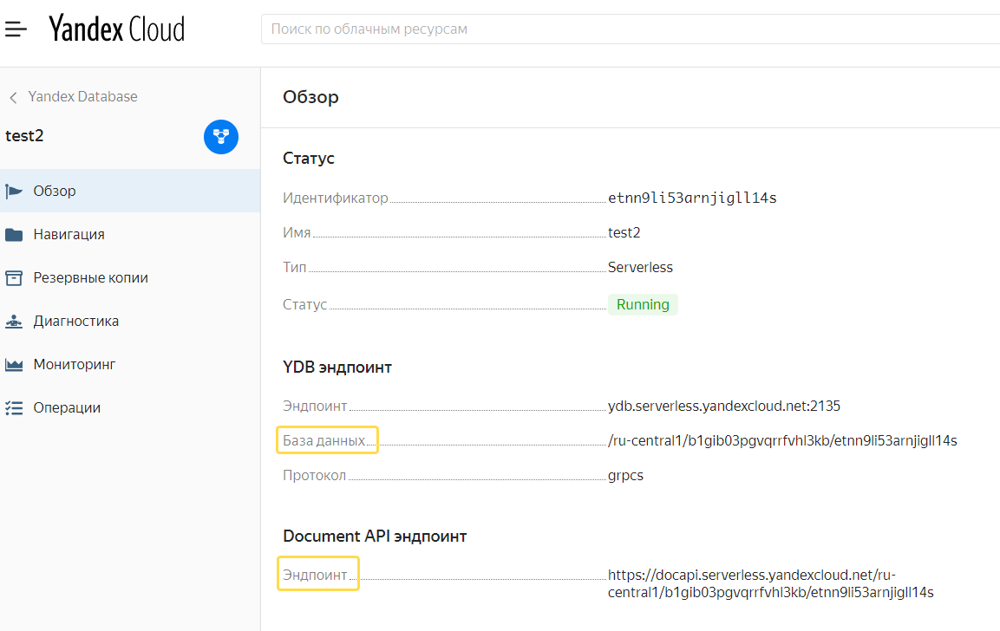

# Основная задача пакета
Данный пакет является дополнением к YDB-SDK (NodeJS SDK для Yandex Database).

В этом документе также приведена документация по YDB-SDK.

Предназначение пакета - уменьшить размер boilerplate для манипуляции с таблицами. Например, в оригинальном SDK Вы должны написать около 90 строк кода для работы с одной таблицей (см. пример в [examples/basic-example-old/data-helpers.ts](examples/basic-example-old/data-helpers.ts)) При этом сам код изобилует многочисленными повторениями в которых достаточно просто совершить опечатку.

Предлагается написать небольшую управляющую структуру вида
```
const series = {
    seriesId: { val: 0, pt: Pt.UINT64, opt: 'r', pk: true },
    title: { val: 'title', pt: Pt.UTF8, opt: 0 },
};
```
см. пример ([examples/basic-example-new-way/table-definitions.ts](examples/basic-example-new-way/table-definitions.ts))

К этой структуре добавляется несколько простых строк с авто выводом типа на основе управляющей структуры, описанием самого класса и его инициализацией:
```javascript
export type ISeries = ConvertStructToTypes<typeof series>;

export class Series extends TypedDataDefs {
    constructor(data: ISeries) {
        super(data);
    }
}

Series.initTableDef(databaseName, 'series', series);
```
После этого Вы можете создавать/удалять таблицу, вставлять данные в таблицу (одиночные и групповые.)


# Оглавление
- [Методы пакета и порядок работы](#manual)
- [Создание базы](#create-db)
- [Формирование ключа для доступа к YDB](#create-db-key)
- [Настройка подключения к базе данных](#connection)
- [Улучшение старой системы описания таблиц](#improvemenet)
- [Новая структура формирования описания таблиц](#new-struct)
- [Краткая информация по работе с YDB SDK](#ydb-sdk)<br>
  - [Драйвер](#driver)<br>
  - [Клиент](#client)<br>
  - [Сессия](#session)<br>
  - [Повторы (retries)](#retries)<br>
  - [Таймауты](#timeouts)<br>
  - [Варианты авторизации в базе данных](#authentication)<br>
    - [Авторизация с использованием авторизованного ключа сервисного аккаунта](#srv_acc)
    - [Авторизация с помощью IAM-токена](#auth_iam)
    - [Авторизация в Yandex database c помощью сервиса метаданных.](#auth_meta)
    - [Анонимная авторизация.](#auth_anonim)
  - [Получить сессию](#get_session)<br>
    - [withSession](#withSession)
    - [withSessionRetry](#withSessionRetry)
  - Повторы при ошибке
    - [withRetries](#withRetries)
  - [Запросы к YDB](#ydb_queries)<br>
    - Начать/завершить транзакцию
      - [beginTransaction](#beginTransaction)
      - [commitTransaction](#commitTransaction)
      - [rollbackTransaction](#rollbackTransaction)
    - Обычные запросы
      - [executeQuery](#executeQuery)
      - [prepareQuery](#prepareQuery)
      - [bulkUpsert](#bulkUpsert)
    - [Скан запросы](#scan_query)
      - [streamExecuteScanQuery](#streamExecuteScanQuery)
      - [streamReadTable](#streamReadTable)
- [Методы хелперы для работы с YDB-SDK](#helpers)
  - [fillTransactionSettings](#fillTransactionSettings)
  - [fillTimeOuts](#fillTimeOuts)
  - [beginTransactionQuick ](#beginTransactionQuick)
  - [executeQueryQuick](#executeQueryQuick)

# <a name="manual">Порядок работы и методы пакета</a>

1. Определитесь с методом авторизации в YDB (более подробно возможные методы авторизации описаны в соответствующем разделе данного руководства). В примере использован метод авторизации с использованием авторизованного ключа сервисного аккаунта, этот ключ нужно записать в файл service_account_key_file.json.<br><br>
    Путь к этому файлу необходимо указать в env.local в переменной YDB_SERVICE_ACCOUNT_KEY_FILE_CREDENTIALS.<br><br>
   Возможные варианты env переменных указаны в YDB-SDK [тут](https://github.com/ydb-platform/ydb-nodejs-sdk/blob/master/src/parse-env-vars.ts) <br>
2. Если Вы используете авторизацию с использованием авторизованного ключа сервисного аккаунта (рекомендуется для приложений кроме функций) то сформируйте ключ как написано [здесь](#create-db-key)
3. Инициализируйте драйвер<br>
   Один из возможных методов инициализации драйвера показан в примере [examples/utils/ydb-functions.ts](examples/utils/ydb-functions.ts)
4. Получите сессию с помощью которой Вы будете выполнять запросы. Сделать это можно с помощью методов withSession и withSessionRetry
5. Стандартный способ выполнения запросов - использовать методы класса Session.<br> Например executeQuery
6. Для полного чтения таблицы (по кускам) используйте streamReadTable, для полного чтения результатов запроса - streamExecuteScanQuery

## Для работы с данными таблицы используйте следующие методы:

1. **upsertToDB** - upsert одной записи. Для работы метода достаточно заполнить только обязательные поля (создать экземпляр класса с обязательными полями). Остальные поля будут не затронуты запросом, но если Вы вставляете новую запись, то не указанные Вами поля будут установлены в null. Метод применятся к текущему экземпляру класса TypedDataDefs.
2. **replaceSeriesToDB** - replace в базу массива записей класса. Для работы метода достаточно заполнить только обязательные поля. Остальные поля автоматически будут установлены в null и соответственно будут установлены в null в YDB.
3. **createDBTable** - создает таблицу в Yandex database на основе управляющей структуры и имени таблицы, переданной при вызове метода initTableDef
4. **dropDBTable** - удаляет таблицу

# <a name="create-db">Создание базы</a>
Создайте serverless базу YDB согласно документации (либо используя terraform)

[Документация](https://cloud.yandex.ru/docs/ydb/quickstart/create-db)

Отличный пример от Виктора Кузенного создания ресурсов с помощью terraform Вы можете посмотреть [тут](https://github.com/kvikuz/sls-web-application)

# <a name="create-db-key">Формирование ключа для доступа к YDB</a>
В директории examples необходимо сформировать ключ для доступа к базе.
Ключ будет сформирован в файле service_account_key_file.json

Запустите команду: (если Вы под windows - то лучше запускать из wsl - в противном случае Вам необходимо убрать слеши из команды)
```
yc iam key create \
--folder-id <идентификатор каталога> \
--service-account-name <имя сервисного аккаунта> \
--output service_account_key_file.json
```


### <a name="yc">yc - консольная утилита для работы из командной строки</a>
Про установку и настройку yc прочитайте тут:

https://cloud.yandex.ru/docs/cli/quickstart

## Создание конфигурационного файла
Создайте файл env.local в корневой директории.
Скопируйте туда строку :
YDB_SERVICE_ACCOUNT_KEY_FILE_CREDENTIALS=service_account_key_file.json
(готовый пример файла уже приведен в данном проекте, в данном файле секреты отсутствуют)

# <a name="connection">Настройка подключения к базе данных</a>

Перейдите в консоль YDB, создайте базу данных и Вы увидите экран с параметрами Вашей базы.

Нажмите на нее и заполните в файле env.local поля:
DOCUMENT_API_ENDPOINT и DATABASENAME

Попутно отмечу что базу данных можно удобно создавать с помощью terraform. Помимо базы данных Вы также можете создать такие ресурсы как каталог, сервисный account и прочие ресурсы.

Прекрасный пример развертывания инфраструктуры на Yandex cloud сделал Виктор Кузенный, Вы можете найти его тут:
https://github.com/kvikuz/sls-web-application

P.S. **Обратите внимание!**
Любой способ инициализации драйвера YDB требует наличия ENV переменных.
Если у Вас компьютер на windows, то Вам необходимо поставить один из пакетов мультиплатформенная поддержки ENV переменных. C этой целью я выбрал dotenv. Для его использования необходимо вызвать **один раз** функцию config (в примере она вызывается в файле examples/utils/ydb-functions.ts).

# <a name="improvemenet">Улучшение старой системы описания таблиц</a>

Если Вы уже пробовали YDB на nodejs, то заметили что предлагается написать, например, interface ISeason, class Season. Если Вы хотите описать опциональное поле, то декоратор надо писать так:
```js
@declareType({ optionalType: { item: { typeId: typePrim } } })
```

Для упрощения написания декораторов добавил два декоратора для описания обязательных и опциональных полей:

declareTypePrim - для описания обязательных полей

declareTypeNull - для описания опциональных полей

Теперь декораторы можно записать проще:
```js
  @declareTypePrim(TypePrim.UINT64)
  public id: number;

  @declareTypeNull(TypePrim.UTF8) // вместо @declareType({ optionalType: { item: { typeId: TypePrim.UTF8 } } })
  public title?: string;
```

Если раньше вместе с классом было необходимо написать интерфейс аналогичного содержания, то теперь я добавил generic тип ITableFromClass для получения типа-интерфейса для использования в методе create. Теперь interface не надо описывать самостоятельно.
```js
type ITMdb = ITableFromClass<Tmdb>;

// Метод create теперь выглядит вот так:
static create(inp: ITMdb) {
 return new Tmdb(inp);
}
```

Пример можно посмотреть в файле [table_defs.ts](examples/basic-example-old/table_defs.ts)

# <a name="new-struct">Новая структура формирования описания таблиц</a>

Писать код для создания таблицы, создания интерфейса, запросы YQL для добавления данных несколько утомительно, поэтому я решил пойти дальше.

В одном из issue я предлагал реализовать кодогенерацию, но в итоге решил сделать в базовом классе возможность работы со всем спектром операций с таблицей - создание и удаление таблицы, вставка данных. Наверно имеет смысл добавить Delete одного элемента по набору полей из primary key.

Текущая реализация позволяет с легкостью выполнять все вышеперечисленные действия:

1. создать/удалить таблицу согласно сформированному описанию таблицы
2. добавить одну строку с данными в таблицу, с возможностью использования опциональных полей (не указывать значения опциональных полей).
3. добавить несколько записей в таблицу (все непереданные поля автоматически устанавливаются в null, необходимо заполнять только обязательные поля)
4. В будущем добавлю реализацию команды bulk upsert для класса - но у нее есть особенности - она не работает с таблицами у которых есть вторичные индексы.

## Для формирования класса для работы с конкретной таблицей необходимо:

Нужно выполнить 3 простых шага:

1. сформировать объект описания таблицы
2. написать строчку для формирования типа - интерфейса (авто вывод типа из объекта-описания таблицы)
3. Вызвать static метод класса initTableDef

### <a name="Создание объекта описания таблицы">Создание объекта описания таблицы</a>
Для использования новой системы описания таблицы YDB необходимо создать объект вида:

```js
const tdef = {
  id: { val: 0, pt: Pt.UINT64, opt: 'r', pk: true },
  title: { val: 'title', pt: Pt.UTF8, opt: 0 },
};
```
Сам объект представляет собой структуру со следующими полями:

|      | Описание                                                     |
| ---- | ------------------------------------------------------------ |
| val  | тип столбца YDB в JS. для отображения полей из YDB в JS возможно использование только следующих типов: number, string, BigInt.<br><br> JSON в YDB отображается на string в JS<br>Поскольку я не могу использовать фактические типы (иначе не получается вывести тип), то вместо типа необходимо задать любое значение<br>Например<br>0 - это number (вы можете поставить любое число, например 1.25)<br>'title' - это string |
| pt   | PrimitiveTypeId - тип столбца в YDB - могут использоваться только определенные значения из enum PrimitiveTypeId (не все из них). Например нельзя указать тип INT8<br>Список типов, которые можно использовать для типизации столбца указан в документации [здесь](https://cloud.yandex.ru/docs/ydb/yql/reference/types/primitive) |
| opt  | optional - нужно указывать либо 'r' - required либо 0.<br> При автоматическом  выводе типа из этого столбца извлекается информация о его типе - string или number |
| pk   | primary key - это единственно не обязательное поле. Может принимать только одно значение - true.<br>Указание данного значения означает что поле входит в состав primary key таблицы. |

* Тип DyNumber в YDB использовать в настоящий момент не рекомендуется.

* Вы можете пользоваться типом Decimal(22,9) который отображается на JS тип BigInt, если точнее то он хранит 64bit целое число.

**Внимание!**<br>
Объект-константу описания таблицы нельзя типизировать с помощью TS потому что он используется для автоматического выведения типа на основе этого объекта и при типизации этого объекта пропадает возможность вывода типа.

### <a name="Автоматический вывод типа выглядит следующим образом:">Автоматический вывод типа выглядит следующим образом:</a>
```js
export type ITdef = ConvertStructToTypes<typeof episode>;
```
(см. [пример](examples/basic-example-new-way/table-definitions.ts))

### <a name="Вызов метода начальной инициализации класса initTableDef">Вызов метода начальной инициализации класса initTableDef</a>
Для осуществления начальной инициализации refMetaData с описанием таблицы YDB, необходимо обязательно вызывать метод initTableDef после определения класса.

Вызов метода initTableDef приводит к формированию необходимых метаданных для таблицы, формированию строк YQL запросов. Вызов этого метода необходим так как у каждого класса (таблицы) свой static объект refMetaData с описанием таблицы YDB.

Пример вызова:

```js
Episodes.initTableDef(databaseName, 'episodes', episode);
```
Где:

| Параметр     | Описание                                                                                                            |
|--------------|---------------------------------------------------------------------------------------------------------------------|
| Episodes         | название класса в котором Вы описали таблицу                                                                        |
| 'episodes'       | название таблицы в базе данных YDB                                                                                  |
| databaseName | значение, ранее сохраненное в поле DATABASENAME (например "/ru-central1/b1gib03pgvqrrfvhl3kb/etnn9li53arnjigll14s") |
| episode         | объект, описывающий структуру таблицы                                                                               |

### <a name="Детали реализации">Детали реализации</a>
Оригинальная версия SDK разработана с учетом сохранения метаинформации о типах данных с использованием Reflect.metadata для свойств класса.

Я решил хранить метаданные, описывающие структуру таблицы (они несколько другие по сравнению с оригинальной SDK) в static свойстве (объекте) refMetaData. Такой подход позволяет легко обращаться к метаданным, перебирать ключи метаданных, запускать forEach и другие полезные методы. Реализация static в JS позволяет обращаться к static свойствам и методам наследующего класса из базового класса, что позволило внедрить в базовый класс TypedDataDef все необходимые методы для построения YQL на основе метаданных и методов работы с базой.


# <a name="ydb-sdk">Краткая информация по работе с YDB SDK</a>

Ранее [в документации](https://cloud.yandex.ru/docs/ydb/ydb-sdk/) были описаны три понятия: **драйвер, клиент, сессия**.

## <a name="driver">Драйвер</a>

Для взаимодействия с YDB необходимо создать экземпляр драйвера, клиента и сессии:

Драйвер YDB отвечает за взаимодействие приложения и YDB на транспортном уровне.
**Драйвер** должен существовать на всем протяжении жизненного цикла работы с YDB. Перед началом работы, необходимо инициализировать драйвер YDB.

В настоящем примере инициализация драйвера осуществляется функцией initYDBdriver (examples/type-utils/ydb-functions.ts).

Для подключения к базе данных необходимо передать авторизационную информацию.
Это можно сделать несколькими способами.
Все возможные способы описаны в [исходном коде SDK](https://github.com/ydb-platform/ydb-nodejs-sdk/blob/master/src/parse-env-vars.ts#L74). Все способы подразумевает определение той или иной ENV переменной.

Обратите внимание, что часть способов уже **_deprecated_**.
Я выбрал наиболее простой способ авторизации в YDB - создал файл с ключами и дал ссылку на него в env.local переменной
```YDB_SERVICE_ACCOUNT_KEY_FILE_CREDENTIALS```

Создание файла с ключами описано в секции ["Формирование ключа для доступа к YDB".](#create-db-key)

При создании драйвера также инициализируется логер.
Поскольку проект учебный - то в env.local добавлена переменная которая выводит максимум отладочной информации:
YDB_SDK_LOGLEVEL=debug

## <a name="client">Клиент</a>

Клиент отвечает за работу с сущностями YDB.

Самостоятельно клиент создавать не требуется (верно для nodejs SDK) - клиент создается самим драйвером в момент инициализации драйвера.

Драйвер инициализирует DiscoveryService, который опрашивает эндпойнты и связывает с каждым эндпойнтом фабрику сессий.

В рамках драйвера создаются **tableClient и schemeClient**, основная причина их разделения - это разные пулы сессий.

У каждого пула свой список используемых и свободных сессий, свои min/max-лимиты. При порождении новой сессии в рамках пула (сессия порождается, если все имеющиеся сессии заняты, но мы еще не вышли за пределы max-лимита на данный пул) по очереди обходятся все известные эндпойнты которые нам вернул DiscoveryService, т.е. запрос 1 на порождение сессии получит ее из эндпойнта1, а запрос 2 получит новую сессию из эндпойнта 2 - это простейший механизм балансировки сессий.

## <a name="session">Сессия</a>

Сессия содержит информацию о выполняемых транзакциях, подготовленных запросах и служит средой для выполнения запросов.

Получать сессию необходимо через клиента путем вызова метода<br>
 driver.tableClient.withSession
либо
 driver.tableClient.withSessionRetry

Единственное отличие этих методов - это параметр maxRetries, который присутствует во втором методе.

При наличии параметра maxRetries служебный метод _withSession пробует исполнить запрос еще раз не более maxRetries раз с **другой** сессией.

Следует отметить, что автор SDK - Timur Sufiev использует первый способ - withSession.
При этом вызов самого запроса оборачивает в withRetries.

## <a name="retries">Повторы (retries)</a>

При создании базы YDB (или потом) может быть установлено ограничение по пропускной способности, RU/с, которое ограничивает максимальное начисление платы за пользование serverless YDB за 1 секунду. В случае большой нагрузки на YDB при обработке запроса может прийти отказ базы из-за превышения лимита начисления. Также возможны проблемы с сетью из за которых может прерваться соединение и т.д.

Поскольку это стандартная ситуация - то предусмотрены механизмы повторения исполнения отправленного запроса.

withSessionRetry повторяет запрос только при получении двух ошибок: BadSession и SessionBusy.

Второй способ сделать повтор запроса - обернуть метод класса в декоратор  @retryable

Третий способ повторения запроса - использование функции-обертки **withRetries**.

withRetries формирует необходимые параметры и вызывает метод RetryStrategy.retry.

RetryStrategy.retry не пересоздает сессию в случае ошибок
RetryStrategy.retry делает ретраи на errors.Unavailable, errors.Aborted, errors.NotFound и errors.Overloaded

В случае если Вы установили лимит на нагрузку БД (например установив ограничение RU/сек) то возможна перегрузка БД запросами. В этом случае будет формироваться исключение errors.Overloaded. В этом случае повтор происходит с увеличенным экспоненциальным таймаутом (см. исходники по RETRYABLE_ERRORS_SLOW).

## <a name="timeouts">Таймауты</a>

В процессе обработки запросов Вы можете передавать в executeQuery ряд параметров, связанных с таймаутами.

Более подробно про таймауты Вы можете прочитать в [документации](https://cloud.yandex.ru/docs/ydb/best_practices/timeouts)

# <a name="authentication">Варианты авторизации в базе данных</a>

Примеры авторизации Вы можете посмотреть в examples. Возможные варианты авторизации описаны далее:

## <a name="srv_acc">Авторизация с использованием авторизованного ключа сервисного аккаунта</a>
Данный метод использован практически для всех имеющихся здесь примеров (за исключением auth).

Предлагаемый метод отличается от авторизации по IAM токену тем, что авторизованный ключ сервисного аккаунта не имеет конечного срока действия в отличие от IAM токена, срок действия которого составляет 12 часов.

Более подробно прочитайте [тут](examples/auth/environ/README.md)

Это один из **основных** методов авторизации.

## <a name="auth_iam">Авторизация с помощью IAM-токена</a>
[Авторизация в YDB CLI](https://cloud.yandex.ru/docs/ydb/reference/ydb-cli/authorization)

[IAM-токен](https://cloud.yandex.ru/docs/iam/concepts/authorization/iam-token)

IAM-токен — уникальная последовательность символов, которая выдается пользователю после прохождения аутентификации. С помощью этого токена пользователь авторизуется в API Yandex.Cloud и выполняет операции с ресурсами.

### <a name="Получите IAM-токен:">Получите IAM-токен:</a>
```bash
yc iam create-token
```
Сохраните полученный токен в файл iam-token.txt в директории examples/auth/access-token-credentials/iam-token.txt

**Время жизни IAM-токена не более 12 часов.**

Проверьте корректность авторизации, запросив информацию о пользователе:

```bash
ydb \
--endpoint ydb.serverless.yandexcloud.net:2135 \
--database /ru-central1/b1gib03pgvqrrfvhl3kb/etnn9li53arnjigll14s \
--iam-token-file iam-token.txt \
discovery whoami \
--groups
```

## <a name="auth_meta">Авторизация в Yandex database c помощью сервиса метаданных.</a>

### <a name="Документация">Документация</a>
[Авторизация в YDB CLI](https://cloud.yandex.ru/docs/ydb/reference/ydb-cli/authorization) (см. вкладку Сервис метаданных)

### <a name="Где работает сервис метаданных">Где работает сервис метаданных</a>
Сервис метаданных работает на виртуальных машинах внутри Yandex compute cloud, а также в serverless функциях Yandex

## <a name="auth_anonim">Анонимная авторизация .</a>
Установите переменную YDB_ANONYMOUS_CREDENTIALS='1' в env.local

Анонимная авторизация используется только при локальной отладке либо при запуске запросов из VM на которой установлен YDB. Также она применяется для запросов к YDB, развернутой в Docker.

## <a name="get_session">Получить сессию</a>

Для получения сессии для работы с данными предназначены методы SDK withSession и withSessionRetry.

Сессия содержит информацию о выполняемых транзакциях и подготовленных запросах.

Получать сессию необходимо через клиента путем вызова метода<br>
 driver.tableClient.withSession
либо
 driver.tableClient.withSessionRetry

Единственное отличие этих методов - это параметр maxRetries, который присутствует во втором методе.

При наличии параметра maxRetries служебный метод _withSession пробует исполнить запрос еще раз не более maxRetries раз с **другой** сессией.

Следует отметить, что автор SDK - Timur Sufiev использует первый способ - withSession.
При этом вызов самого запроса оборачивает в withRetries.

### <a name="withSession">withSession</a>

```
withSession<T>(
	callback: SessionCallback<T>,
	timeout: number = 0) : : Promise<T>
```

Метод служит для получения сессии для запроса данных.

Первый параметр - callback, который получает ID созданной сессии.

Пример:

```
await driver.tableClient.withSession(async (session) => { работа с данными в рамках сессии}
```

Внутри withSession обращается к пулу сессий для клиента и выбирает из этого пула первую свободную сессию, либо создает новую.

В случае если уже создано maxLimit сессий и timeout >0, то withSession запускает таймер со значением timeout. Если до истечения таймаута не находится свободной сессии, то возвращается reject.

Вы можете вернуть внутри callback некие данные типа T, которые в свою очередь вернет withSession по завершении сессии.

### <a name="withSessionRetry">withSessionRetry</a>

```
withSessionRetry<T>(
	callback: SessionCallback<T>,
	timeout: number = 0,
	maxRetries = 10): Promise<T>
```

Параметры и предназначение метода полностью аналогичны методу withSession.

Дополнительно withSessionRetry обрабатывает ошибки BadSession и SessionBusy в случае их возникновения предпринимается попытка создать новую сессию.

В случае, если в процессе исполнения запросов внутри сессии произошла ошибка, BadSession или SessionBusy, то создается новая сессия и производится попытка опять повторить выполнение callback целиком. Все это происходит не более maxRetries раз (по умолчанию задано значение 10)

# <a name="retry_call">Повторы при ошибке</a>

### <a name="withRetries">withRetries</a>

```
withRetries<T>(
	originalFunction: () => Promise<T>,
	strategyParams?: RetryParameters)
```

Функция принимает в качестве параметра функцию, внутри которой идет работа с данными и вторым параметром передаются параметры для стратегии повторов при ошибке.

Параметры для создания стратегии повторов:

| Параметр            | Описание                                                     |
| ------------------- | ------------------------------------------------------------ |
| maxRetries          | По умолчанию 10 - максимальное количество повторов           |
| onYdbErrorCb        | функция callback, которая вызывается при возникновении ошибки и принимает один параметр типа YdbError |
| backoffCeiling      | параметры для стратегии экспоненциального ретрая.<br />максимальное значение экспоненты<br />по умолчанию 6 |
| backoffSlotDuration | значение в миллисекундах, на которое умножается экспоненциальный коэффициент.<br />по умолчанию 1000 |


При ошибке errors.Overloaded включается стратегия экспоненциального ожидания повтора в которой применяются параметры backoffCeiling, backoffSlotDuration. При первом повторе процесс засыпает и ждет backoffSlotDuration миллисекундах, при втором повторе ожидание составит  ```2*backoffSlotDuration ``` . Каждая последующая попытка повтора умножает это время на 2 до тех пор пока не будет backoffCeiling повторов. После этого время уже не увеличивается.

withRetries обрабатывает ошибки, описанные в классе YdbError и пытается повторить выполнение запросов не более maxRetries раз.

Вместо применения обертки withRetries Вы можете применить декоратор **retryable** того же назначения.


## <a name="ydb_queries">Запросы к YDB</a>

### <a name="executeQuery">executeQuery</a>

```js
public async executeQuery(
  query: PrepareQueryResult | string,
  params: IQueryParams = {},
  txControl: IExistingTransaction | INewTransaction = AUTO_TX,
  operationParams?: IOperationParams,
  settings?: ExecDataQuerySettings,
  collectStats: Ydb.Table.QueryStatsCollection.Mode | null = null
```

Это основной метод для работы с данными.

| Параметр | Описание                                                                                                                                                                                                                                                                       |
|----------|--------------------------------------------------------------------------------------------------------------------------------------------------------------------------------------------------------------------------------------------------------------------------------|
| query    | может представлять как запрос, подготовленный с помощью prepareQuery, так и обычный запрос YQL в строковом формате.                                                                                                                                                      |
| params   | В запросе YQL Вы можете определить что в него будут передаваться фактические параметры. В этот аргумент передается объект в ключах которого указывается имя параметра, определенного в запросе YQL, например $seriesData, передаваемое значение зависит от описания типа в YQL |
| txControl | Параметр для контроля за транзакциями. Более подробно будет описано ниже                                                                                                                                                                                                       |
| operationParams | описание смотри ниже                                                                                                                                                                                                                                       |
| settings | При необходимости можно установить в значение {keepInCache: true}. Более подробно параметр описан ниже.                                                                                                                                                                        |
| collectStats | если Вам необходимо узнать сколько записей прочитано (пропорционально этому показателю начисляется плата за запрос RU) - то передайте значение STATS_COLLECTION_BASIC или STATS_COLLECTION_FULL                                                                                |

В объект **operationParams** входят следующие показатели:

| Параметр         | Описание                                                                                                                                                                                                                                                                                                                                                                                                                                                          |
|------------------|-------------------------------------------------------------------------------------------------------------------------------------------------------------------------------------------------------------------------------------------------------------------------------------------------------------------------------------------------------------------------------------------------------------------------------------------------------------------|
| operationMode    | всегда устанавливается в null                                                                                                                                                                                                                                                                                                                                                                                                                                     |
| operationTimeout | **Таймаут на операцию** <br>Значение operation_timeout определяет время, в течение которого результат запроса интересен пользователю.<br> Если за данное время операция не выполнилась, сервер возвращает ошибку c кодом Timeout и попытается прекратить выполнение запроса, однако отмена запроса не гарантируется.<br> Таким образом, запрос, на который пользователю была возвращена ошибка Timeout, может быть как успешно выполнен на сервере, так и отменен |
| cancelAfter      | **Таймаут отмены операции**<br>Значение cancel_after определяет время, через которое сервер начнет отмену запроса, если отменить запрос возможно. В случае успешной отмены запроса сервер вернет ошибку с кодом Cancelled.                                                                                                                                                                                                                                        |
| labels           | Метки, определенные пользователем<br>Представляют из себя обычный объект JS со значениями string<br> В настоящий момент не используется                                                                                                                                                                                                                                                                                                                           |
| reportCostInfo   | в настоящий момент не используется                                                                                                                                                                                                                                                                                                                                                                                                                                |

_Примечание:_
Значения таймаутов может устанавливаться либо в секундах, либо в наносекундах
Пример (в обоих случаях задан таймаут 3 секунды):
```
operationTimeout : {seconds: 3}
или
operationTimeout : {nanos: 3e9}
```

---
Параметр **settings**

<a name="keepInCache">У этого параметра может быть только одно установленное значение  {keepInCache: true}</a>

В этом случае значение переданное в параметре query сохраняется в кеше на стороне сервера. Фактически происходит синтаксический разбор запроса и из него формируется preparedQuery, ID которого возвращается после выполнения запроса.

Количество возможных мест хранения в кеше ограничено, устаревшие значения выталкиваются из кеша по алгоритму Least recently used (LRU).

Не рекомендуется сохранять в кеше подготовленные запросы.

После выполнения запроса при установленном ключе  {keepInCache: true} Вы получите ID preparedQuery в возвращаемых данных в ключе queryMeta.id

ID подготовленного запроса будет выглядеть так:  "ydb://preparedqueryid/4?id=9ccafa6-945df2a2-e53d1813-e3772c42" <br>Далее Вы можете использовать этот ID в следующем запросе

---
Параметр **txControl** - параметры транзакций и возможные варианты.

1. Можно передать в executeQuery заранее созданную транзакцию с помощью метода beginTransaction. (полный пример доступен [тут](examples/transaction/transaction_begin.ts))<br>метод beginTransaction возвращает ID транзакции, который можно определить так:

```js
  { txId: transaction.id }
```

  По окончании запроса транзакцию необходимо самостоятельно закомитить либо откатить. Для этого используются методы commitTransaction и rollbackTransaction.

2. Для одиночного запроса можно инициировать транзакцию и сразу ее закомитить.<br>В этом случае параметр будет выглядеть так (использован helper fillTransactionSettings из настоящего пакета):

```js
   { beginTx: fillTransactionSettings('serializableReadWrite'), commitTx: true }
```

  Всего возможно три вида транзакций
  * Serializable
  * Online Read-Only
  * Stale Read Only

  Более подробно Вы можете почитать в [документации](https://cloud.yandex.ru/docs/ydb/concepts/transactions#modes)

Хелпер **_fillTransactionSettings_** возвращает правильно заполненный объект для передачи в YDB. Вы должны выбрать один из желаемых видов транзакции. Для типа транзакции onlineReadOnly Вы также можете передать параметр allowInconsistentReads.

3. Вы можете инициировать создание транзакции в первом запросе executeQuery и завершить транзакцию в последнем запросе. Полный пример смотрите [тут](examples/transaction/transaction_chain.ts)

```js
    В первом запросе Вы должны открыть транзакцию - но не комитить ее по завершении запроса
   { beginTx: fillTransactionSettings('serializableReadWrite'), commitTx: false }

    Во второй и последующие запросы Вы должны передавать transaction ID полученный после выполенения первого запроса
   { txId: data.txMeta.id, commitTx: false }

   И, наконец, в последнем запросе Вы должны завершить транзакцию - либо явно в самом конце вызвать метод commitTransaction
   { txId: data.txMeta.id, commitTx: true }
```

В большинстве случаев вместо явного открытия транзакции с помощью beginTransaction и последующего commitTransaction лучше использовать параметры контроля транзакций в вызовах executeQuery. Это позволит избежать лишних обращений к YDB и эффективней выполнять запросы. (экономится два обращения к базе)

В то же время для улучшения читаемости кода для не сильно нагруженных приложений возможно имеет смысл явно указать beginTransaction/ commitTransaction

Помните, что если Вам нужно сделать несколько запросов к базе (например выполнить запись в несколько таблиц) - то практически всегда Вы сможете записать Ваши запросы в одном YQL предложении с параметрами что позволит обойтись всего одним обращением к YDB.

***

### <a name="prepareQuery">**prepareQuery**</a>

Служит для подготовки запросов до передачи их методу executeQuery

Если у Вас один запрос выполняется несколько раз с разными данными, то настоятельно рекомендуется использовать только параметризованные запросы. Это позволяет БД выполнить подготовительную работу по разбору и оптимизации запроса только один раз.

```js
public async prepareQuery(
  queryText: string,
  operationParams?: IOperationParams): Promise<PrepareQueryResult>
```

| Параметр | Описание                                       |
|---|------------------------------------------------|
| queryText | строка запроса YQL включая возможные параметры |
| operationParams | см. описание параметра в executeQuery         |

### <a name="bulkUpsert">bulkUpsert</a>

Массовая дешевая вставка данных. Плата за вставку данных с помощью bulkUpsert будет несколько ниже.

```js
async bulkUpsert(
  table: string,
  rows: TypedValue,
  operationParams?: IOperationParams)
```


| Параметр        | Описание                                                                                                                                               |
|-----------------|--------------------------------------------------------------------------------------------------------------------------------------------------------|
| table           | полное имя таблицы вида "/ru-central1/b1gib03pgvqrrfvhl3kb/etnn9li53arnjigll14s/series" - т.е. databaseName + имя таблицы включая все необходимые пути |
| operationParams | см. описание параметра в executeQuery                                                                                                                  |
| rows | массив данных для записи, обычно формируемый static методом asTypedCollection в который передается массив объектов класса, например [Series ...]      |

<p style="background: rgba(255,136,0,.15);">
<br>
<strong>Внимание!</strong> bulkUpsert не работает с таблицами у которых есть вторичные индексы.
<br>
</p>
### <a name="beginTransaction">beginTransaction</a>

начать новую транзакцию

```
beginTransaction(
	txSettings: ITransactionSettings,
	operationParams?: IOperationParams)
```

| Параметр        | Описание                                                     |
| --------------- | ------------------------------------------------------------ |
| txSettings      | сюда Вы должны передать тип транзакции - один из  serializableReadWrite ,onlineReadOnly, staleReadOnly.<br>Проще всего передать тип транзакции с помощью функции-хелпера fillTransactionSettings |
| operationParams | сюда можно передать граничные значения таймаутов<br>Это проще сделать с помощью функции-хелпера  fillTimeOuts |


### <a name="commitTransaction">commitTransaction</a>

завершить транзакцию и записать изменения в базу данных

```
commitTransaction(
	txControl: IExistingTransaction,
	operationParams?: IOperationParams)
```

| Параметр        | Описание                                                     |
| --------------- | ------------------------------------------------------------ |
| txSettings      | сюда Вы должны передать ID существующей транзакции  в виде объекта {txId : string} |
| operationParams | сюда можно передать граничные значения таймаутов<br>Это проще сделать с помощью функции-хелпера  fillTimeOuts |

### <a name="rollbackTransaction">rollbackTransaction</a>

откатить все изменения в рамках существующей транзакции

```
rollbackTransaction(
	txControl: IExistingTransaction,
	operationParams?: IOperationParams)
```

| Параметр        | Описание                                                     |
| --------------- | ------------------------------------------------------------ |
| txSettings      | сюда Вы должны передать ID существующей транзакции  в виде объекта {txId : string} |
| operationParams | сюда можно передать граничные значения таймаутов<br>Это проще сделать с помощью функции-хелпера  fillTimeOuts |


## <a name="scan_query">Скан запросы</a>
Результатом выполнения скан запроса является автоматическое выполнение запроса сервером с последующим вызовом callback при поступлении данных от сервера.

### <a name="streamExecuteScanQuery">streamExecuteScanQuery</a>

```js
async streamExecuteScanQuery(
  query: PrepareQueryResult | string,
  consumer: (result: ExecuteScanQueryPartialResult) => void,
  params: IQueryParams = {},
  settings?: ExecuteScanQuerySettings)
```

| Параметр | Описание                                                                                                                                                                                                                                                                       |
|----------|--------------------------------------------------------------------------------------------------------------------------------------------------------------------------------------------------------------------------------------------------------------------------------|
| query    | может представлять как запрос, подготовленный с помощью prepareQuery, так и обычный запрос YQL в string                                                                                                                                                                        |
| params   | В запросе YQL Вы можете определить что в него будут передаваться фактические параметры. В этот аргумент передается объект в ключах которого указывается имя параметра, определенного в запросе YQL, например $seriesData, передаваемое значение зависит от описания типа в YQL |
| txControl | Параметр для контроля за транзакциями. Например Вы можете передать внешний идентификатор транзакции и потом закрыть транзакцию после выполнения ряда запросов.                                                                                                                 |
| settings | **неизвестно** - принимает объект с ключами mode:                      {     MODE_UNSPECIFIED ,MODE_EXPLAIN ,MODE_EXEC       } и вторым ключом withMode- функцией                                                                                                              |
| consumer | функция на вход которой поступает массив частичных значений из запроса и структура со статистикой.<br>Загрузка следующей порции данных производится самим сервером. Чем то напоминает cursor в других SQL серверах                                                                  |

### <a name="streamReadTable">streamReadTable</a>

```js
async streamReadTable(
  path: string,
  consumer: (result: Ydb.Table.ReadTableResult) => void,
  settings?: ReadTableSettings)
```


| Параметр | Описание                                                                                                                                                                                                                                                                                                                  |
|----------|---------------------------------------------------------------------------------------------------------------------------------------------------------------------------------------------------------------------------------------------------------------------------------------------------------------------------|
| path    | название таблицы с префиксом - databaseName, может включать в себя длинный путь. Например path может быть такой:<br> "/ru-central1/b1gib03pgvqrrfvhl3kb/etnn9li53arnjigll14s/bulk_upsert/log_messages"<br>здесь bulk_upsert - имя директории<br>log_messages - имя таблицы                                                |
| settings | проще всего управлять данным параметром с помощью класса ReadTableSettings<br>Вы можете выбрать какие столбцы вернуть в ответе, указать сколько строк возвращать за один раз, надо ли упорядочить вывод значений (по primary key), также доступно большое количество операций по отбору необходимых значений первичного ключа |
| consumer | функция на вход которой поступает массив частичных значений из запроса и структура со статистикой.<br>Переход к следующему chank данных производится самим сервером. Чем то напоминает cursor в других SQL серверах                                                                                                       |


# <a name="helpers">Методы хелперы для работы с YDB-SDK</a>

## <a name="fillTransactionSettings">fillTransactionSettings</a>

Заполняет типы транзакций в YDB-SDK более понятным способом

```
fillTransactionSettings(
    txType: TransactionType,
    allowInconsistentReads?: boolean | null
)
```

## <a name="fillTimeOuts">fillTimeOuts</a>

Заполняет параметры таймаутов для транзакций  в YDB-SDK более понятным способом

```
fillTimeOuts(
	operationTimeout?: number,
	cancelAfter?: number)
```

Для упрощение работы произведено **расширение функционала пакета YDB-SDK** и добавлены новые сигнатуры функций с более простым заполнением параметров.

## <a name="beginTransactionQuick">beginTransactionQuick - новый метод класса Session</a>

начинает транзакцию

```
beginTransactionQuick(
    txType: TransactionType,
    allowInconsistentReads?: boolean | null,
    operationTimeout?: number,
    cancelAfter?: number
)
```


| Параметр               | Описание                                                     |
| ---------------------- | ------------------------------------------------------------ |
| txType                 | Передайте значение из типа  TransactionType = 'serializableReadWrite' / 'onlineReadOnly' / 'staleReadOnly' для выбора типа транзакции |
| allowInconsistentReads | Данные параметр  параметр применяется только если Вы выбрали тип транзакции onlineReadOnly<br /><br />  *false* (consistent reads). В данном режиме каждое из чтений по отдельности возвращает консистентные данные, но консистентность данных между разными чтениями не гарантируется. Дважды выполненное чтение одного и того же диапазона таблицы может вернуть разные результаты. <br /><br />*true* (inconsistent reads). В данном режиме данные даже для отдельно взятого чтения могут содержать не консистентные результаты. |
| operationTimeout       | Задается в секундах<br />Значение `operation_timeout` определяет время, в течение которого результат запроса интересен пользователю. Если за данное время операция не выполнилась, сервер возвращает ошибку c кодом `Timeout` и попытается прекратить выполнение запроса, однако отмена запроса не гарантируется. Таким образом, запрос, на который пользователю была возвращена ошибка `Timeout`, может быть как успешно выполнен на сервере, так и отменен. |
| cancelAfter            | Задается в секундах<br />Значение `cancel_after` определяет время, через которое сервер начнет отмену запроса, если отменить запрос возможно. В случае успешной отмены запроса сервер вернет ошибку с кодом `Cancelled` |


## <a name="executeQueryQuick">executeQueryQuick - новый метод класса Session</a>

выполняет запрос к YDB

```
executeQueryQuick = async function (
    query: Ydb.Table.PrepareQueryResult | string,
    params?: IQueryParams,
    txControl?: IExistingTransaction | INewTransaction,
    timeOuts?: { operationTimeout?: number; cancelAfter?: number },
    casheSettings = false,
    collectStats?: Ydb.Table.QueryStatsCollection.Mode | null
)
```


| Параметр                        | Описание                                                     |
| ------------------------------- | ------------------------------------------------------------ |
| query                           | может представлять как запрос, подготовленный с помощью prepareQuery, так и обычный запрос YQL в string |
| params                          | В запросе YQL Вы можете определить что в него будут передаваться фактические параметры. В этот аргумент передается объект в ключах которого указывается имя параметра, определенного в запросе YQL, например $seriesData, передаваемое значение зависит от описания типа в YQL |
| txControl: IExistingTransaction | Передайте ID существующей транзакции в формате {txId: string} |
| txControl: INewTransaction      | Передайте параметры новой транзакции в формате {     txType: TransactionType;     commitTx?: boolean;     allowInconsistentReads?: boolean  }<br />Более подробно см. в описании параметров beginTransactionQuick |
| timeOuts                        | Таймауты<br />Более подробно см. в описании параметров beginTransactionQuick |
| casheSettings                   | Параметр сохранения запроса сервером в кеше. Более подробно смотри [тут](#keepInCache) |
| collectStats                    | если Вам необходимо узнать сколько записей прочитано (пропорционально этому показателю начисляется плата за запрос RU) - то передайте значение STATS_COLLECTION_BASIC или STATS_COLLECTION_FULL |


